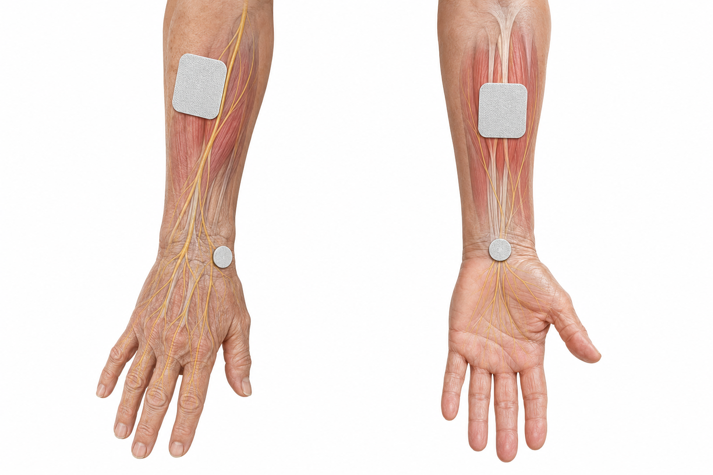

This instruction manual details the placement of surface electrodes for **Sensory Electrical Stimulation (SES)** to manage Essential Tremor (ET). This therapy uses low-level current to target the sensory pathways leading to the brain's tremor control centers (thalamus and cerebellum).

---

### **Safety & Expectations**
*   **The Goal:** You should feel a **"strong but comfortable" tingling or tickling** sensation.
*   **The Limit:** Do **NOT** increase the power until the muscles twitch or the hand moves involuntarily. This is the **Motor Threshold (MT)**; SES must remain **sub-motor** (below that level).
*   **Skin Care:** Apply electrodes only to healthy, intact skin. Do **not** place them over rashes, sores, or areas with "razor burn" from shaving.
*   **Warning:** **Never** place electrodes across the chest, near the heart, or on the front of the neck.

---

### **Configuration A: 2-Electrode Setup (Single Channel)**
*Best for simple setups targeting a specific nerve branch to disrupt the tremor signal.*

| **Step** | **Patient Instructions (Normal Language)** | **Clinical Notes (Medical Language)** |
| :--- | :--- | :--- |
| **1. Target** | Focus on the **outer edge of your wrist**, on the same side as your thumb. | Target the **superficial branch of the radial nerve** at the lateral aspect of the wrist. |
| **2. Placement** | Place the two small round stickers about one inch apart along the bone on the thumb-side of your wrist. | Apply a pair of **0.8-inch circular electrodes** longitudinally over the radial nerve path near the styloid process. |
| **3. Testing** | Turn on the device slowly. You should feel tingling on the **back of your hand and your thumb**. | Confirm placement via **sensory mapping**; stimulus should correspond to the radial nerve's cutaneous distribution. |

---

### **Configuration B: 4-Electrode Setup (Dual Channel)**
*The "Gold Standard" for fully jamming the tremor circuit by targeting both the "top" and "bottom" muscle groups of the arm.*

#### **Pair 1: The Inner Side (Channel 1 - Flexors)**
| **Location** | **Patient Instructions (Normal Language)** | **Clinical Notes (Medical Language)** |
| :--- | :--- | :--- |
| **Wrist** | Place one sticker in the **center of your inner wrist**, where you would feel a pulse. | Place electrode over the **median nerve** at the volar aspect of the wrist. |
| **Forearm** | Place the second sticker on your inner forearm, **four fingerbreadths** down from the crease of your elbow. | Position electrode over the **Flexor Carpi Radialis (FCR) motor point**, distal to the bicep tendon. |

#### **Pair 2: The Outer Side (Channel 2 - Extensors)**
| **Location** | **Patient Instructions (Normal Language)** | **Clinical Notes (Medical Language)** |
| :--- | :--- | :--- |
| **Wrist** | Place one sticker on the **back of your wrist**, on the outer thumb-side edge. | Place electrode over the **radial nerve** branch at the posterior/lateral wrist. |
| **Forearm** | Place the second sticker on the top of your forearm, **two fingerbreadths** down from the outer "funny bone" of your elbow. | Position electrode over the **Extensor Carpi Radialis (ECR) motor point**, distal to the lateral epicondyle. |

---

### **Pairing and Connection Logic**
To ensure the electrical circuit works correctly, you must pair the electrodes **Inner-to-Inner** and **Outer-to-Outer**:

1.  **Channel 1 (Inner Circuit):** Connect the two wires from the first plug to the two electrodes on the **palm-side** (Inner Wrist + Inner Forearm). This manages the "downward" flexing motion.
2.  **Channel 2 (Outer Circuit):** Connect the two wires from the second plug to the two electrodes on the **back-side** (Outer Wrist + Outer Forearm). This manages the "upward" extending motion.

### **Final Verification**
Once connected:
1.  **Syncing:** If using a device like **OpenXstim**, the device will alternate between these two pairs.
2.  **Sensation:** Ensure both channels provide a comfortable "pins and needles" feeling without causing the fingers to curl or the wrist to jump.
3.  **Duration:** Standard sessions last **20 to 40 minutes**, often providing relief that lasts for an hour or more after the session ends.